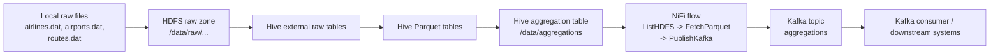
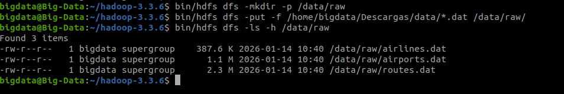
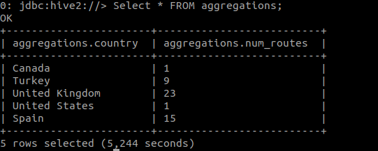
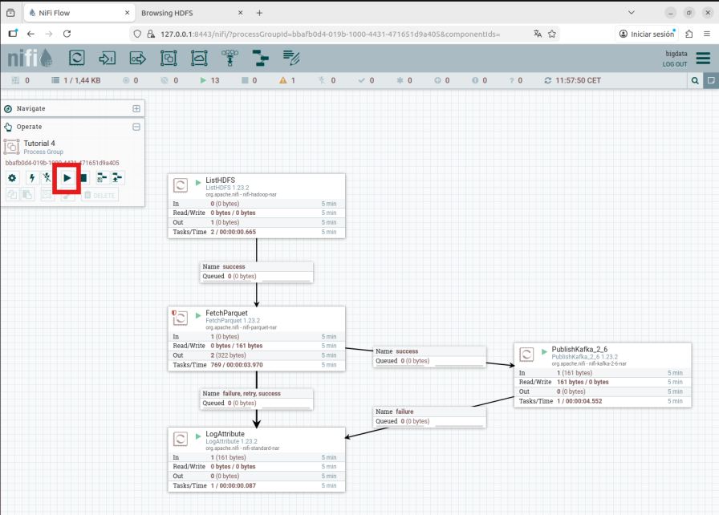
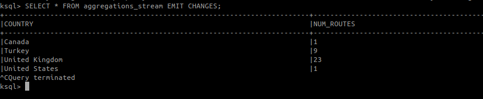

# Airline Route ETL Pipeline with HDFS, Hive, NiFi, and Kafka

This project simulates a **production-style data engineering pipeline**, transforming raw aviation datasets into curated analytical outputs and delivering them as streaming events.

The pipeline ingests raw airline, airport, and route data into **HDFS**, models it in **Hive**, transforms it into **Parquet-based analytical tables**, and publishes curated results to **Kafka** through **Apache NiFi**.

---

## 🎯 Project Goal

> How many non-stop routes (`stops = 0`) to destinations with altitude greater than 5000 are operated by inactive airlines, grouped by destination country?

---

## 🔥 Key Features

* End-to-end batch ETL pipeline on a big data stack
* Transformation from raw text data to optimized Parquet format
* SQL-based analytical modeling using Hive
* Event-driven data delivery using Apache NiFi
* Streaming output via Kafka
* Modular and reproducible pipeline using scripts

---

## 🧠 Why this project matters

This project demonstrates a complete data engineering workflow:

* Raw file ingestion into distributed storage (HDFS)
* Schema definition with Hive external tables
* Transformation into optimized analytical format (Parquet)
* Business-driven aggregation using SQL
* Data delivery using NiFi
* Streaming output using Kafka

---

## 🏗️ Architecture



---

## 🛠️ Tech Stack

* HDFS
* Hive
* Apache NiFi
* Apache Kafka
* Parquet
* Linux shell

---

## 📂 Repository Structure

```text
airline-route-etl-pipeline/
├── config/
├── data/
├── docs/
├── nifi/
├── scripts/
├── sql/
└── screenshots/
```

---

# 🔄 Pipeline Explained Step by Step

---

## 🟢 STEP 1 — Data Ingestion (Extract)

Raw datasets:

* airlines.dat
* airports.dat
* routes.dat

These files are uploaded into:

```
/data/raw/
```

👉 This represents the **raw data layer** of the pipeline.

---

## 🔵 STEP 2 — Hive Raw Tables

External tables are created in Hive pointing to HDFS raw files.

👉 This allows querying raw data **without modifying it**.

---

## 🟡 STEP 3 — Transformation to Parquet

Raw data is converted into Parquet format.

👉 Benefits:

* faster queries
* better compression
* columnar storage

---

## 🟣 STEP 4 — Aggregation Layer

A final analytical table is created applying:

* non-stop routes
* altitude > 5000
* inactive airlines

👉 This produces the **business-ready dataset**.

📄 SQL logic available in:

```
sql/aggregations.hql
```

---

## 🔴 STEP 5 — Data Delivery (NiFi)

NiFi processes the final dataset.

Flow used:

```
ListHDFS → FetchParquet → PublishKafka
```

👉 Components:

* ListHDFS → detects new files
* FetchParquet → reads data
* PublishKafka → sends data to Kafka

---

## 🟠 STEP 6 — Streaming Output (Kafka)

Final results are published to:

```
aggregations
```

Example output:

```json
{"country":"Canada","num_routes":1}
{"country":"Turkey","num_routes":9}
{"country":"United Kingdom","num_routes":23}
{"country":"United States","num_routes":1}
```

---

## 📊 Pipeline Execution (Screenshots)

### HDFS Raw Data



### Hive Aggregation Result



### NiFi Flow



### Kafka Output



---

## ⚙️ How to Run

```bash
bash scripts/01_start_hdfs.sh
bash scripts/02_upload_to_hdfs.sh
bash scripts/03_create_raw_tables.sh
bash scripts/04_create_parquet_tables.sh
bash scripts/05_create_aggregations.sh
bash scripts/06_run_kafka_consumer.sh
```

---

## 🧩 Engineering Decisions

**HDFS** → scalable storage layer
**Hive** → SQL transformation layer
**Parquet** → optimized analytical performance
**NiFi** → orchestration and data movement
**Kafka** → streaming delivery

---

## 🚧 Challenges & Learnings

* Handling inconsistent `.dat` file formats
* Designing joins across multiple datasets
* Optimizing storage with Parquet
* Configuring NiFi processor relationships
* Integrating batch processing with streaming systems

---

## 🚀 Future Improvements

* Add Apache Airflow orchestration
* Implement data quality checks
* Containerize with Docker
* Add monitoring and logging
* Scale pipeline with Spark

---

## 💼 CV / LinkedIn Summary

> Designed and implemented an end-to-end ETL pipeline using HDFS, Hive, Apache NiFi, and Kafka, transforming raw aviation data into optimized analytical datasets and delivering results as streaming events.

---

## Notes

* Refactored from an academic project into a production-style pipeline
* Some configurations may vary depending on your local environment
